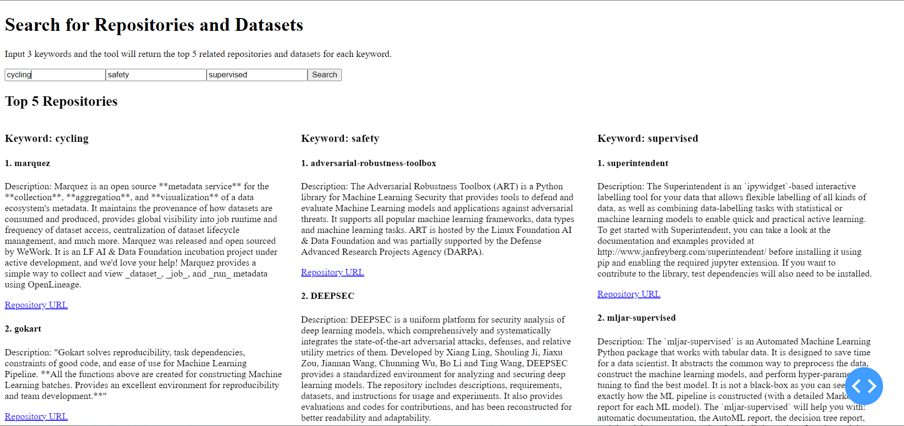

# SDSC Cataglog
[](sdsc-cataglog/readme.de)

## Topic and Background
The main purpose of this project is to implement an application that can output github tools and openml datasets that correspond to the user input. The user can add a description of his current challenge faced and the tool can propose related information to this challenge.

## Contribution
We all know that the now popular ChatGPT has shown a strong knowledge base in various fields. Especially when combined with bing search, it is able to provide corresponding websites directly on demand. But ChatGPT has some limitations:
1. ChatGPTs' knowledge is trained on data before September 2021, so there is no way to provide information after this date.
2. ChatGPT has no way to analyze complex logical relationships.
3. ChatGPT cannot list cited sources and its reliability is based on the reliability of the source information, which may be inherently wrong, inconsistent, or incorrect or contradictory after being combined by ChatGPT.

So we use advanced algorithms combined with ChatGPT to counter the limits these limitations.

## Idea of the Project
To address the problems of chatgpt, such as lack of ability to analyze complex input, complex responses, inability to provide real-time tools, and possible errors in the links provided, our core idea is to
1. Decompose the requirements and only ask simple questions to gpt at a time.
2. Restrict the output so that the output is brief and linked to the topic.
3. Use github api to get the latest github, to ensure the popularity and effectiveness of the tool.

## Tutorial
### How to Run the Tool
For usage in the console, run in the console:
```
python sdsc_cataglog.py
```
If you want to use a visual interface run the notebook `app.ipynb` and open the website.


### Console: Example Output on the Topic of Cycling Safety
After starting the tool in the console, the user can input his use case. The tool will summarize the current challenge and will extract keywords which are used to search for related repositories. It will return the repositories like in the following example:


### Website: Example Output on the Topic of Cycling Safety
After starting the tool the user can input 3 keywords.


After pressing search it will return the top 5 related github repositories and openml dataset for each keyword.


