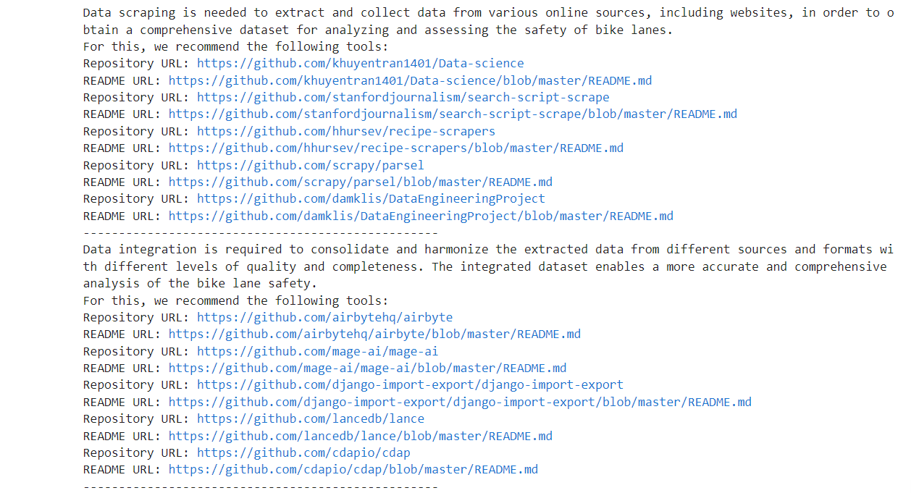
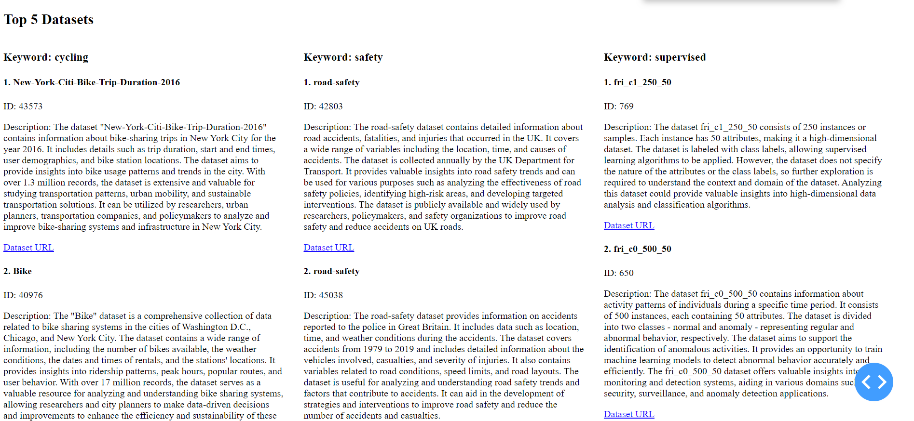

# SDSC Cataglog
[](readme.en.md)

# Thema und Hintergrund
Das Hauptziel dieses Projekts ist die Implementierung einer Anwendung, die Github-Tools und Openml-Datensätze ausgeben kann, die den Benutzereingaben entsprechen. Der Benutzer kann eine Beschreibung seiner aktuellen Herausforderung hinzufügen, und das Tool kann entsprechende Informationen zu dieser Herausforderung vorschlagen.

Wir alle wissen, dass das mittlerweile ChatGPT ein starkes Wissen in verschiedenen Bereichen aufweist. Vor allem in Kombination mit der Bing-Suche ist es in der Lage, entsprechende Websites direkt auf Anfrage zu liefern. Aber ChatGPT hat einige Einschränkungen:
1. Das Wissen von ChatGPT ist auf Daten vor September 2021 trainiert, so dass es keine Möglichkeit gibt, Informationen nach diesem Datum zu liefern.
2. ChatGPT hat keine Möglichkeit, komplexe logische Beziehungen zu analysieren.
3. ChatGPT kann keine zitierten Quellen auflisten und seine Verlässlichkeit basiert auf der Verlässlichkeit der Quelleninformationen, die von Natur aus falsch, inkonsistent, falsch oder widersprüchlich sein können, nachdem sie von ChatGPT kombiniert wurden.


# Idee
Um die Probleme von ChatGPT zu lösen, wie z.B. die mangelnde Fähigkeit, komplexe Eingaben zu analysieren, komplexe Antworten, die Unfähigkeit, Echtzeit-Tools bereitzustellen, und mögliche Fehler in den bereitgestellten Links. Unsere Kernideen ist:
1. Die Anforderungen zu zerlegen und jeweils nur einfache Fragen an ChatGPT zu stellen.
2. Die Ausgabe einzuschränken, damit sie kurz und themenbezogen ist.
3. Verwendung der Github-API, um die neuesten Github-Daten zu erhalten, um die Popularität und Effektivität des Tools zu gewährleisten.

## Tutorial
### So führen Sie das Tool aus
Für die Verwendung in der Konsole, führen Sie es in der Konsole aus:
```
python sdsc_cataglog.py
```
Wenn Sie eine visuelle Schnittstelle verwenden möchten, führen Sie das Notebook `app.ipynb` aus und öffnen Sie die Website.


### Konsole: Beispielausgabe zum Thema Sicherheit beim Radfahren
Nach dem Start des Tools in der Konsole kann der Nutzer seinen Anwendungsfall eingeben. Das Tool fasst die aktuelle Herausforderung zusammen und extrahiert Schlüsselwörter, die für die Suche nach verwandten Repositories verwendet werden. Es gibt die Repositories wie im folgenden Beispiel zurück:


### Website: Beispielausgabe zum Thema Sicherheit beim Radfahren
Nach dem Start des Tools kann der Benutzer 3 Schlüsselwörter eingeben.


Nachdem Sie auf "Suchen" gedrückt haben, werden die 5 wichtigsten Github-Repositories und openml-Datensätze für jedes Stichwort angezeigt.




